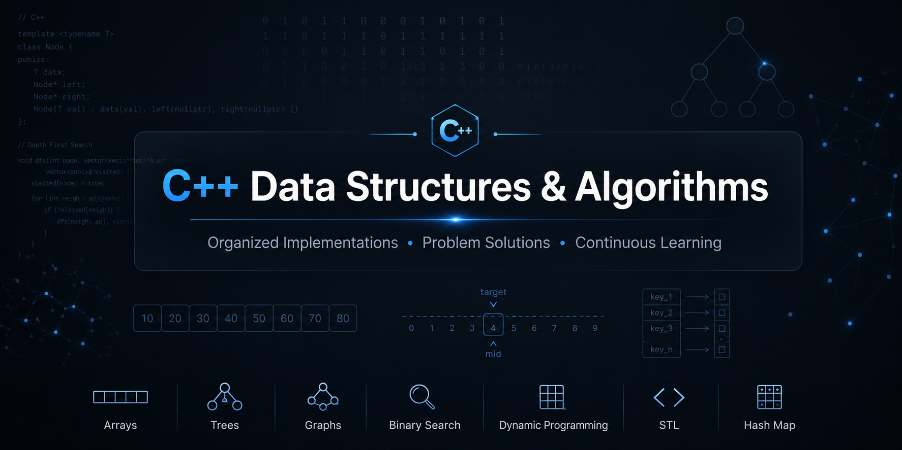

  

# C++ Data Structures & Algorithms

# DSA in C++

This repository contains my Data Structures and Algorithms practice in C++.

## Goals

- Build strong DSA fundamentals
- Improve problem-solving skills
- Track my learning journey
